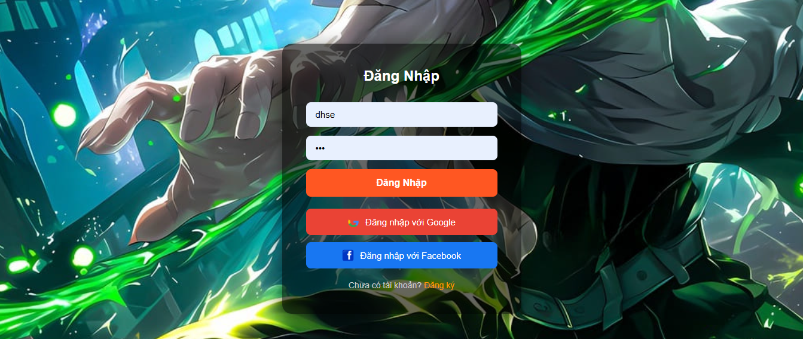
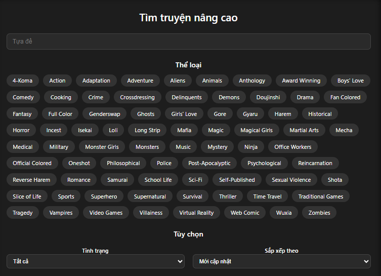
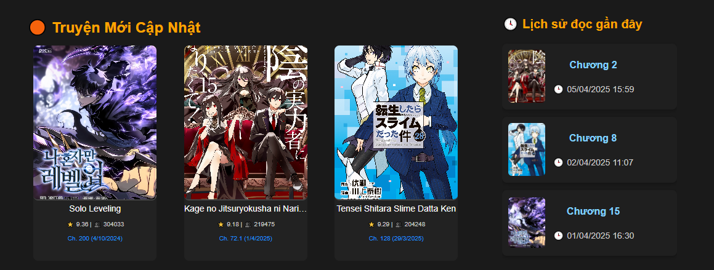

# 📚 Online Manga Reader Website

> A modern web application for reading manga online, supporting user authentication via Google and Facebook, search filters, and reading history tracking using APIs.

## 🌟 Key Features

### 🔐 1. Authentication with Google and Facebook
- Secure login via **Google** and **Facebook** OAuth.
- Also supports traditional email/password login.
- Uses **JWT** for session handling.



---

### 🔎 2. Advanced Manga Search
- Filter manga by **title**, **genre**, **status**, and **sort order**.
- Genre filter includes tags like Action, Romance, Fantasy, etc.



---

### 🕮 3. Reading History
- Automatically tracks user's reading activity.
- Shows last read **chapter** and **timestamp** for each manga.

📌 On **Dashboard**:


📌 On **Home Page**:



---

## ⚙️ Technologies Used

- **Frontend**: HTML, CSS, JavaScript, EJS
- **Backend**: Node.js (Express), JWT, OAuth 2.0
- **Database**: MySQL (with Sequelize)
- **API Integration**: MangaDex API
- **Auth Libraries**: Google & Facebook OAuth

---

## 👤 Developer

- Role: Fullstack Developer (Student Project)
- Email: ngqbinh456@gmail.com

---

## 📝 Setup & Run

```bash
git clone https://github.com/your-username/manga-reader.git
cd manga-reader
npm install
npm start
